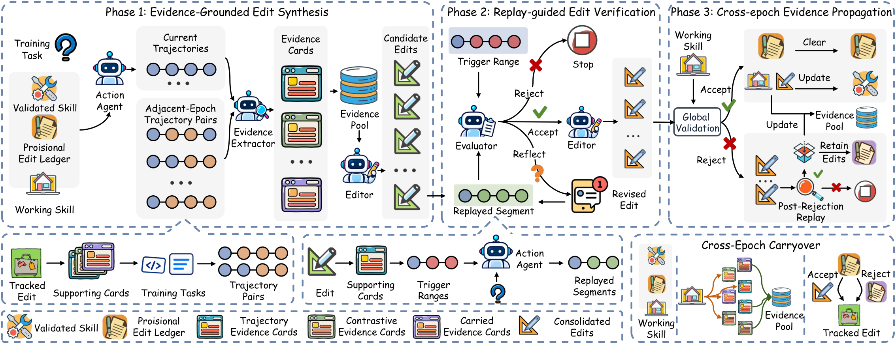

# EVISKILL

EVISKILL is an evidence-grounded framework for continual skill evolution in
interactive LLM agents. Instead of directly committing text generated from a
trajectory, the system keeps the execution support for each revision as a
Replayable Evidence Card, verifies linked edits by targeted replay, and uses
validation to decide which information becomes persistent skill knowledge.



## Method Overview

The framework follows the three complementary phases shown above.

1. **Evidence-Grounded Edit Synthesis.** The Action Agent rolls out the
   current Working Skill on training tasks. An Evidence Extractor turns local
   behavior into Trajectory Evidence Cards and, when adjacent-epoch behavior is
   available, Contrastive Evidence Cards. Cards are stored in the Evidence
   Pool and grouped into Evidence Windows. An editor uses each window to
   construct candidate edits while preserving links to the supporting cards
   and trigger ranges.

2. **Replay-Guided Edit Verification.** Each candidate edit is applied only in
   the execution segments cited by its cards. The Action Agent replays the
   linked trigger ranges and an evaluator returns `accept`, `reflect`, or
   `reject`. A reflected edit is revised and replayed again. Accepted edits are
   consolidated into the epoch candidate; unsupported edits are excluded from
   that candidate while their evidence remains available for later processing.

3. **Cross-Epoch Evidence Propagation.** Global validation compares the epoch
   candidate with the current Validated Skill. An accepted revision updates the
   Validated Skill. After a global rejection, replay-supported edits can be
   retained in the Provisional Edit Ledger and used by the next Working Skill,
   while the Evidence Pool preserves the cards needed for continued synthesis,
   correction, and cross-epoch comparison.

The Working Skill is the execution-time skill for training and revision. It is
reconstructed from the latest Validated Skill and the ordered Provisional Edit
Ledger. The final evaluation uses the validated revision selected by the
validation gate; model parameters are not updated by EVISKILL.

## Repository Layout

```text
Eviskill/
  configs/main/                 One reproducibility YAML per benchmark
  configs/alfworld/config_tw.yaml
                                ALFWorld runtime configuration used by EviSkill
  scripts/run_*world.sh         Benchmark launchers
  scripts/run_from_config.py    YAML resolver and command launcher
  scripts/run_eviskill.py       Evolution pipeline entry point
  scripts/serve_scienceworld_env.py
                                EviSkill-owned ScienceWorld HTTP server
  wmsm/                         Evidence, replay, validation, and runners
  skills/                       Initial skill documents
  docs/framework.png            Framework figure used in this README
```

## Installation

Use Python 3.9 or newer from the environment in which the selected benchmark
package is installed:

```bash
cd Eviskill
python -m pip install -e . -r requirements-evidence.txt
```

Install the benchmark runtime and data for the dataset you want to run:

- **ALFWorld:** ALFWorld/TextWorld and the `json_2.1.1` data layout.
- **AppWorld:** the AppWorld Python package and its data directory.
- **ScienceWorld:** the ScienceWorld Python package or checkout and its
  `scienceworld.jar` backend.

The benchmark packages and datasets are intentionally not bundled with this
repository. Their local paths are supplied through the YAML environment
variables below.

## Dataset Downloads

Use the official benchmark sources for the environment packages and data:

| Benchmark | Official source | What to obtain |
| --- | --- | --- |
| ALFWorld | [alfworld/alfworld](https://github.com/alfworld/alfworld) | ALFWorld/TextWorld runtime and the `json_2.1.1` data directory |
| AppWorld | [StonyBrookNLP/appworld](https://github.com/StonyBrookNLP/appworld) | AppWorld package and its data directory |
| ScienceWorld | [allenai/ScienceWorld](https://github.com/allenai/ScienceWorld) | ScienceWorld Python runtime and `scienceworld.jar` |

The repositories above contain the authoritative installation and download
instructions. The exact experiment split is then produced locally by the
split-building scripts below.
 <!-- For ScienceWorld, the source manifests are the
SkillNet-derived files released with the [SkillNet experiments]
(https://github.com/zjunlp/SkillNet/tree/main/experiments). The split builder
expects `train.json`, `dev.json`, and `test.json` and checks their fingerprints
before constructing the 96/48/full split. -->

## Prepare Splits

Run these commands from `Eviskill/`. The generated manifests are the inputs
referenced by the three main configurations.

### ALFWorld

```bash
python scripts/build_alfworld_split.py \
  --data-root /absolute/path/to/alfworld-data \
  --output-dir data/splits/alfworld_main
```

### AppWorld

```bash
python scripts/build_appworld_split.py \
  --appworld-data-dir /absolute/path/to/appworld-data \
  --output-dir data/splits/appworld_official
```

### ScienceWorld

The source directory must contain the released `train.json`, `dev.json`, and
`test.json` manifests used by the experiment.

```bash
python scripts/build_scienceworld_split.py \
  --source-dir /absolute/path/to/scienceworld-manifests \
  --output-dir data/splits/scienceworld_main
```

## Configure the Runtime

Each benchmark has one main configuration file:

```text
configs/main/alfworld.yaml
configs/main/appworld.yaml
configs/main/scienceworld.yaml
```

The files contain the model profiles, evolution protocol, split manifests,
and benchmark-specific runtime settings. Set only the paths needed by the
selected benchmark:

```bash
export OPENAI_BASE_URL="https://your-openai-compatible-endpoint/v1"
export OPENAI_API_KEY="your-api-key"

export ALFWORLD_DATA="/absolute/path/to/alfworld-data"       # ALFWorld
export APPWORLD_DATA_DIR="/absolute/path/to/appworld-data"   # AppWorld
export SCIENCEWORLD_PATH="/absolute/path/to/ScienceWorld"    # ScienceWorld
export SCIENCEWORLD_JAR_PATH="/absolute/path/to/ScienceWorld/scienceworld/scienceworld.jar"
```

<!-- `ALFWORLD_PATH` is optional. Set it only when the ALFWorld package is used
from a source checkout rather than installed in the active Python environment.
The ALFWorld runtime YAML is already included at
`configs/alfworld/config_tw.yaml`; it reads the data root from `ALFWORLD_DATA`.

AppWorld and ScienceWorld environment servers are launched with the current
Python interpreter. No machine-specific `server_python` path is required.
The server implementation for ScienceWorld is included in
`scripts/serve_scienceworld_env.py`. -->

## Run an Experiment

Only the two profiles used by the main experiments are exposed:
`gpt-5.5` and `qwen3.5-4b`.

```bash
cd Eviskill

scripts/run_alfworld.sh qwen3.5-4b
scripts/run_appworld.sh qwen3.5-4b
scripts/run_scienceworld.sh qwen3.5-4b
```

Replace the profile with `gpt-5.5` for the remote GPT configuration. The
launcher reads the corresponding YAML, resolves environment variables, checks
the command-line arguments, and starts the evolution pipeline.

Inspect a resolved command without starting a benchmark:

```bash
python scripts/run_from_config.py \
  --config configs/main/scienceworld.yaml \
  --profile qwen3.5-4b \
  --dry-run --allow-placeholders
```

## Outputs and Reproducibility

Each run writes its artifacts under the configured `output_dir`, including:

- `resolved_config.json`: the resolved dataset YAML;
- `resolved_command.txt`: the exact pipeline command;
- `action_runtime_config.json`: the effective Action Agent runtime used for
  resume and evaluation consistency;
- trajectories, Evidence Cards, Evidence Pool updates, replay decisions,
  revisions, validation records, and Working Skill state.

The JSON files are generated snapshots, not additional input configurations.
They redact secret-looking fields. Reusing an output directory checks that the
effective Action Agent runtime has not changed; use a new output directory for
a deliberately different run.
